# 🛍️ TechStore — Modern Vue 3 E-Commerce Platform

<p align="center">
  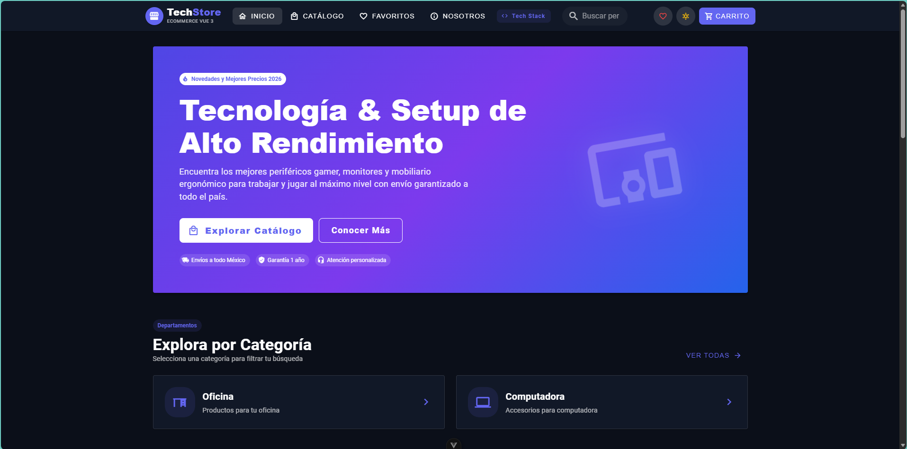
</p>

<p align="center">
  <strong>Plataforma de comercio electrónico de alto rendimiento, moderna, reactiva y totalmente responsiva.</strong><br>
  Diseñada como proyecto insignia para portafolio técnico, destacando arquitectura escalable, tipado estricto de extremo a extremo, persistencia reactiva y experiencia de usuario (UX/UI) de nivel comercial.
</p>

<p align="center">
  <a href="https://vuejs.org/"></a>
  <a href="https://www.typescriptlang.org/"></a>
  <a href="https://pinia.vuejs.org/"></a>
  <a href="https://vuetifyjs.com/"></a>
  <a href="https://vitejs.dev/"></a>
  <a href="https://vueuse.org/"></a>
</p>

---

## 📑 Tabla de Contenidos

- [🌟 Resumen Ejecutivo](#-resumen-ejecutivo)
- [📸 Galería Visual & Módulos Destacados](#-galería-visual--módulos-destacados)
  - [1. Página Principal & Hero Showcase](#1-página-principal--hero-showcase)
  - [2. Catálogo & Sistema de Filtros Reactivos](#2-catálogo--sistema-de-filtros-reactivos)
  - [3. Soporte de Temas Claro y Oscuro (Dark / Light)](#3-soporte-de-temas-claro-y-oscuro-dark--light)
  - [4. Vista Detallada de Producto](#4-vista-detallada-de-producto)
  - [5. Lista de Deseos (*Wishlist Drawer*) con Persistencia](#5-lista-de-deseos-wishlist-drawer-con-persistencia)
  - [6. Carrito de Compras & Motor de Cupones](#6-carrito-de-compras--motor-de-cupones)
  - [7. Pasarela de Pago Multicanal & Simulador de Métodos](#7-pasarela-de-pago-multicanal--simulador-de-métodos)
  - [8. Comprobante Digital de Compra e Impresión](#8-comprobante-digital-de-compra-e-impresión)
- [🏗️ Arquitectura y Flujo de Datos](#️-arquitectura-y-flujo-de-datos)
- [💡 Aspectos Técnicos Destacados](#-aspectos-técnicos-destacados)
- [📂 Estructura del Proyecto](#-estructura-del-proyecto)
- [🛠️ Stack Tecnológico](#️-stack-tecnológico)
- [💻 Instalación y Puesta en Marcha](#-instalación-y-puesta-en-marcha)
- [📄 Licencia & Créditos](#-licencia--créditos)

---

## 🌟 Resumen Ejecutivo

**TechStore** es una Single Page Application (SPA) enfocada en la comercialización de periféricos de alta gama, monitores gamer y mobiliario ergonómico para estaciones de trabajo (*workspaces*).

El propósito central de esta plataforma es servir como **muestra técnica de alto nivel para reclutadores, líderes técnicos y clientes**, demostrando:

1. **Clean Code & Arquitectura Modular**: Desacoplamiento de componentes, stores modulares y separación clara de responsabilidades.
2. **Tipado Estricto de Datos**: Modelado exhaustivo con TypeScript sin recurrir a tipos permisivos (`any`).
3. **Gestión de Estado Centralizada**: Utilización de Pinia para sincronizar carrito, lista de deseos, catálogo y notificaciones globales con persistencia automática en `localStorage`.
4. **Diseño Visual Profesional (Material Design 3)**: Interfaz estética construida con Vuetify 3, soporte nativo de modo claro/oscuro, microinteracciones suaves y retroalimentación inmediata.
5. **Privacidad y Seguridad Demostrativa**: Proceso de pago completo simulado que respeta la privacidad del desarrollador y del usuario, sin filtrar datos personales ni requerir servicios externos de terceros.

---

## 📸 Galería Visual & Módulos Destacados

### 1. Página Principal & Hero Showcase
Landing page con navegación fluida, propuesta de valor, accesos directos al catálogo, métricas de satisfacción y sección de testimonios de clientes verificados.

#### 1.1 Hero Banner & Barra de Navegación
Hero con llamado a la acción principal, badges de confianza e insignia de promociones destacadas.
<p align="center">
  
</p>

#### 1.2 Categorías & Productos Populares
Acceso a departamentos destacados con iconos temáticos y carrusel de productos más solicitados.
<p align="center">
  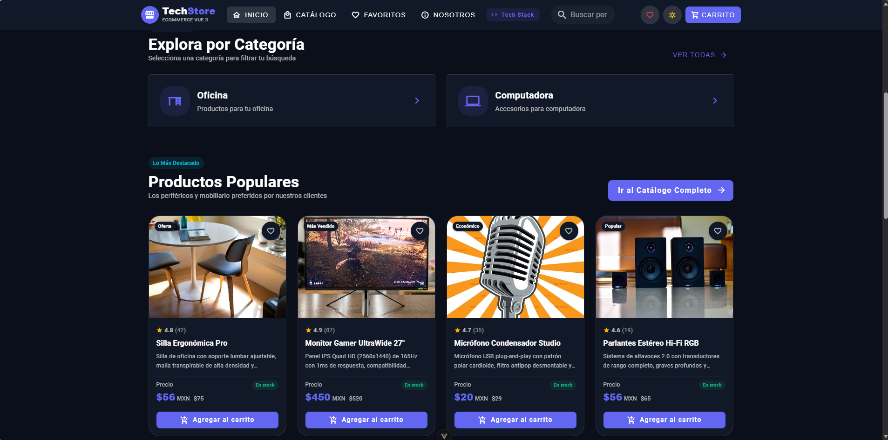
</p>

#### 1.3 Métricas de Confianza & Reseñas de Clientes
Indicadores clave de rendimiento (KPIs) y testimonios reales con avatar y calificación por estrellas.
<p align="center">
  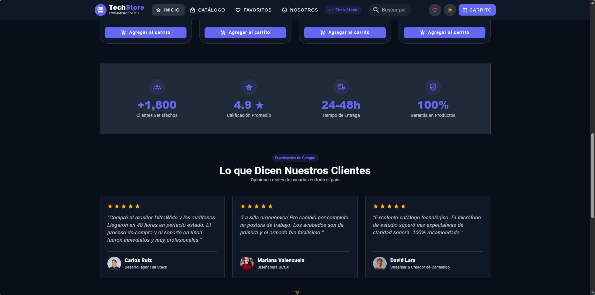
</p>

#### 1.4 Banner de Cierre & Pie de Página
Llamado a la acción secundario y footer corporativo con enlaces a redes y sellos de seguridad.
<p align="center">
  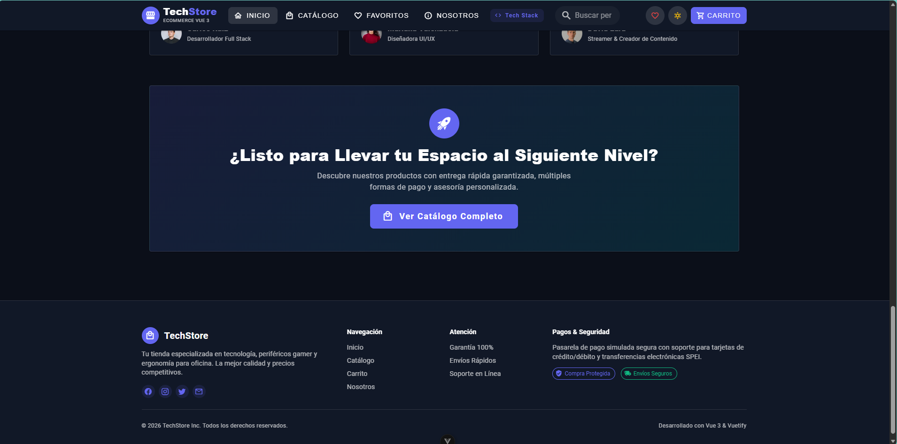
</p>

---

### 2. Catálogo & Sistema de Filtros Reactivos
Exploración avanzada de productos con filtrado dinámico en tiempo real y ordenamiento multicriterio.

#### 2.1 Vista General del Catálogo
Panel lateral de filtros integrados y cuadrícula adaptativa con badges de stock, ofertas y calificaciones.
<p align="center">
  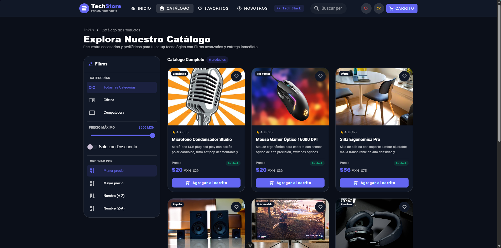
</p>

#### 2.2 Filtrado por Rango de Precio y Ordenamiento
Ajuste interactivo con control deslizante (*slider*) acotado hasta $350 MXN y ordenamiento por mayor precio.
<p align="center">
  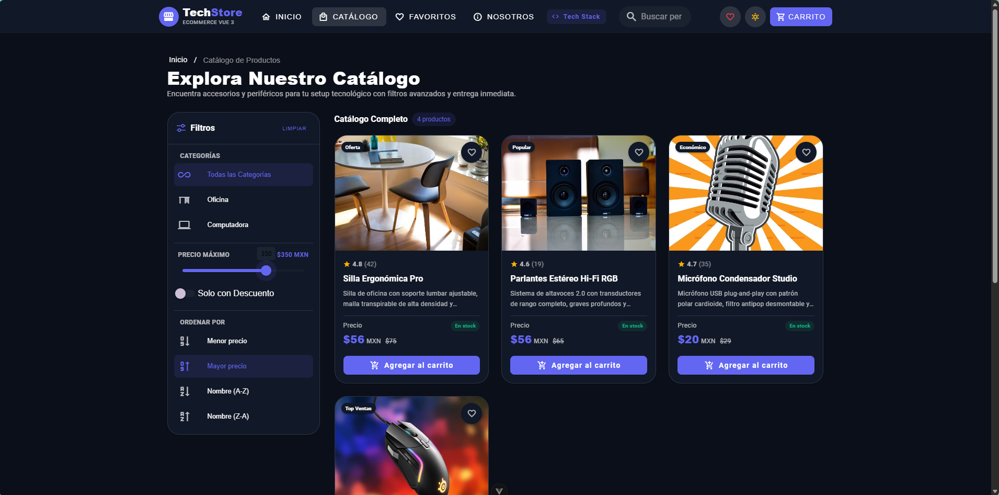
</p>

#### 2.3 Filtrado por Categoría Específica
Segmentación inmediata por departamento (ej. Computadora) con contador dinámico de artículos encontrados.
<p align="center">
  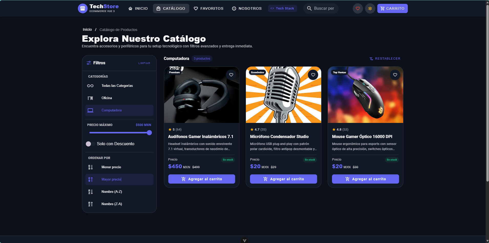
</p>

#### 2.4 Ordenamiento Alfabético
Organización lexicográfica instantánea de productos de la A a la Z.
<p align="center">
  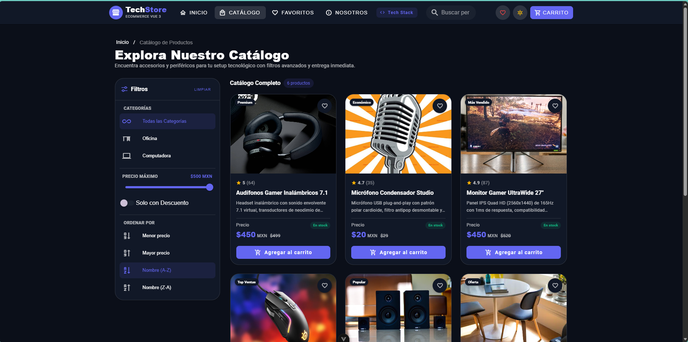
</p>

#### 2.5 Navegación Inferior del Catálogo
Paginación fluida y enlaces de navegación rápida hacia categorías y soporte.
<p align="center">
  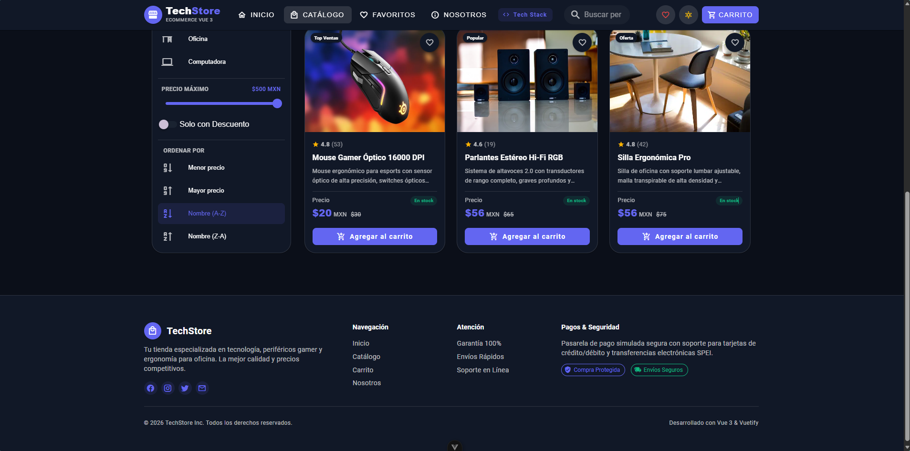
</p>

---

### 3. Soporte de Temas Claro y Oscuro (Dark / Light)
Conmutador dinámico en la barra superior con paleta Slate / Índigo adaptada a Material Design 3, cumpliendo con los estándares de contraste y accesibilidad WCAG AA.

| ☀️ Modo Claro | 🌙 Modo Oscuro |
| :---: | :---: |
| 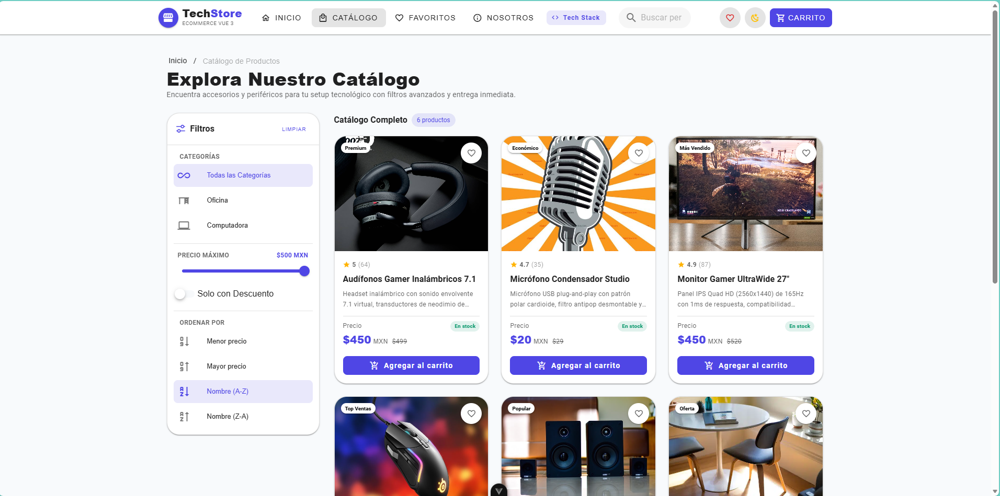 | 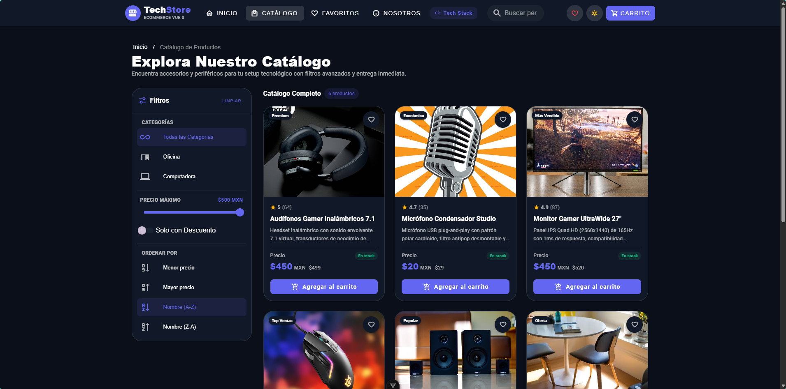 |

---

### 4. Vista Detallada de Producto
Página dedicada de producto con galería en alta resolución, cálculo instantáneo de ahorro sobre precio de lista, selector de cantidad por pasos y botón de compra directa.

<p align="center">
  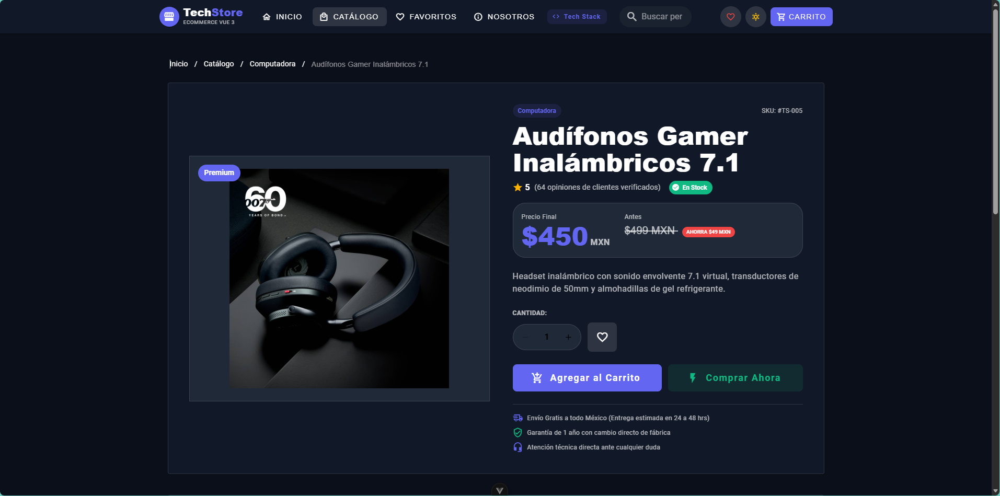
</p>

* **Aspectos técnicos**: Parámetros de ruta dinámicos (`/products/:id`), badges de disponibilidad en almacén y persistencia de artículos seleccionados.

---

### 5. Lista de Deseos (*Wishlist Drawer*) con Persistencia
Cajón lateral retráctil (*Navigation Drawer*) para consultar y gestionar artículos guardados con sincronización permanente en el almacenamiento local del navegador.

<p align="center">
  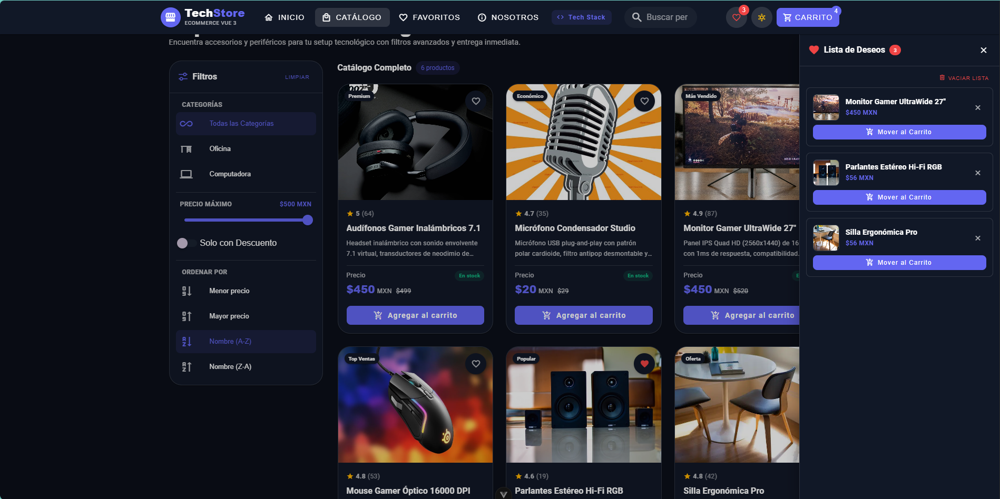
</p>

* **Aspectos técnicos**: Sincronización en tiempo real mediante `useLocalStorage` de `@vueuse/core`, contador dinámico con badge en la barra superior y acción para transferir favoritos directamente al carrito.

---

### 6. Carrito de Compras & Motor de Cupones
Gestión granular de productos con actualización reactiva de subtotales, cálculo automático de impuestos, envío gratuito y un motor interactivo de cupones de descuento.

#### 6.1 Resumen de Artículos y Selector de Cupones
Control granular de unidades (`+` / `-`), eliminación individual o vaciado completo del carrito.
<p align="center">
  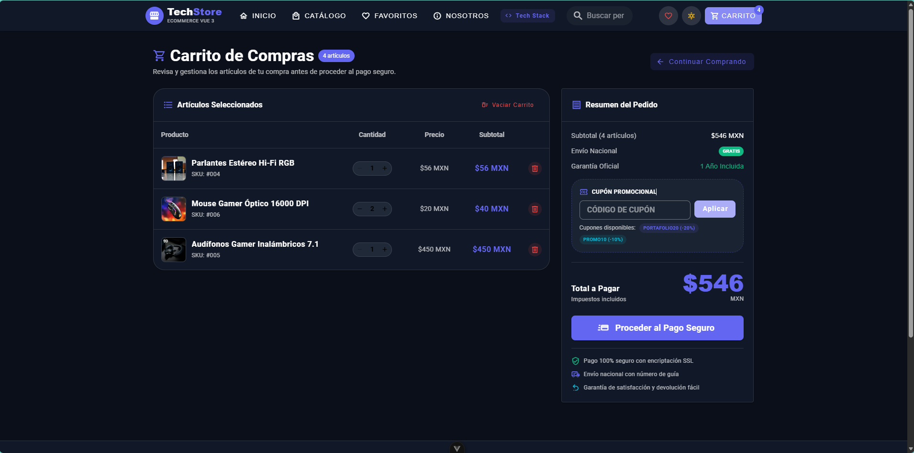
</p>

#### 6.2 Cupón Promocional Aplicado
Aplicación exitosa del código `PORTAFOLIO20` (-20% de descuento) con desglose en verde esmeralda y total recalculado en tiempo real ($437 MXN).
<p align="center">
  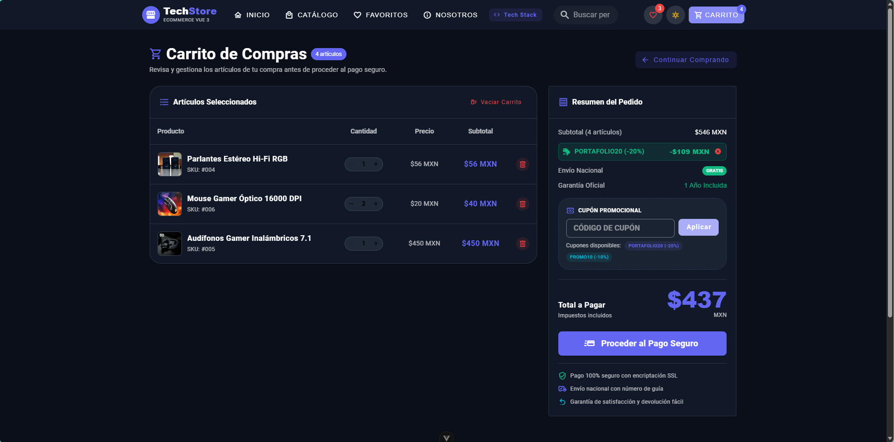
</p>

---

### 7. Pasarela de Pago Multicanal & Simulador de Métodos
Flujo de pago guiado en 3 pasos con validaciones estrictas y simulación de métodos bancarios y en efectivo.

#### 7.1 Paso 1: Formulario de Envío y Destinatario Validado
Validación rigurosa de campos (nombre alfabético, correo en formato RFC, teléfono a 10 dígitos y código postal a 5 dígitos).
<p align="center">
  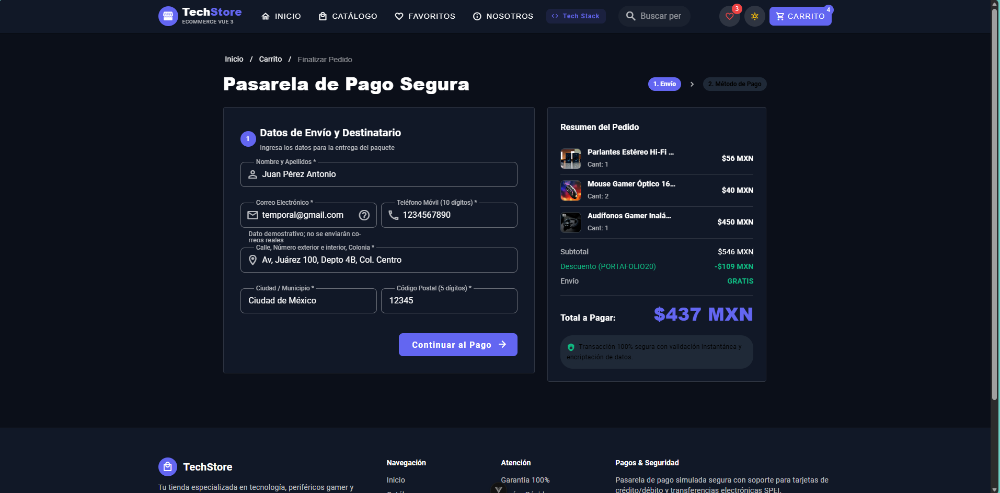
</p>

#### 7.2 Paso 2: Tarjeta de Crédito / Débito Virtual Interactiva
Maqueta visual interactiva que renderiza en tiempo real los dígitos, titular y fecha de vencimiento (`MM/AA`), validando que la tarjeta no esté caducada.
<p align="center">
  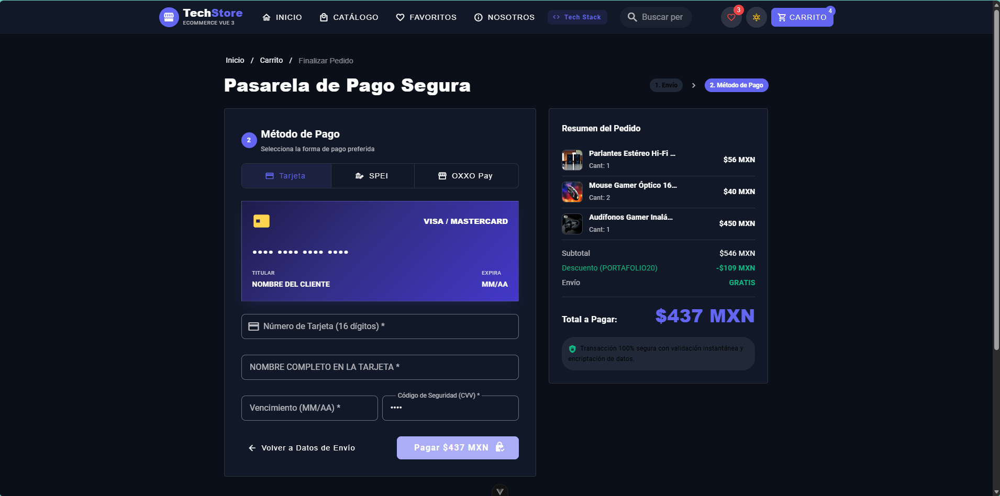
</p>

#### 7.3 Paso 2: Transferencia Interbancaria (SPEI)
Generación de CLABE interbancaria demostrativa y referencia de rastreo con botón de copiado en 1 clic.
<p align="center">
  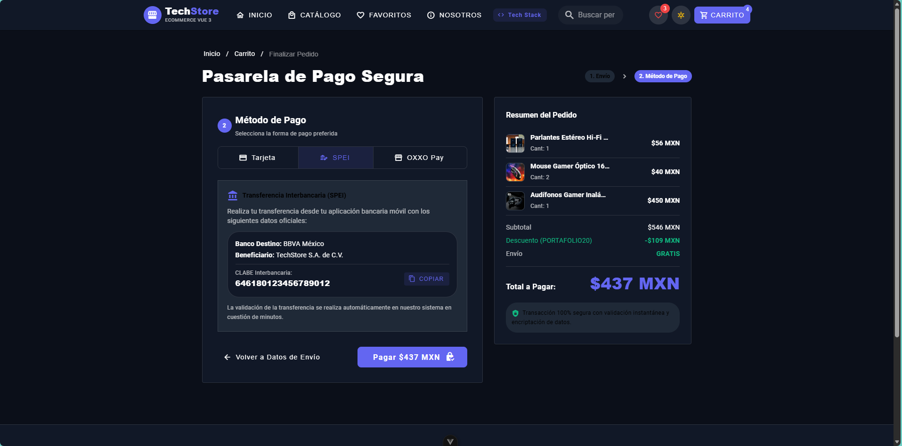
</p>

#### 7.4 Paso 2: Pago en Efectivo (OXXO Pay)
Generación de código de barras numérico y ficha demostrativa para pago en tiendas de conveniencia.
<p align="center">
  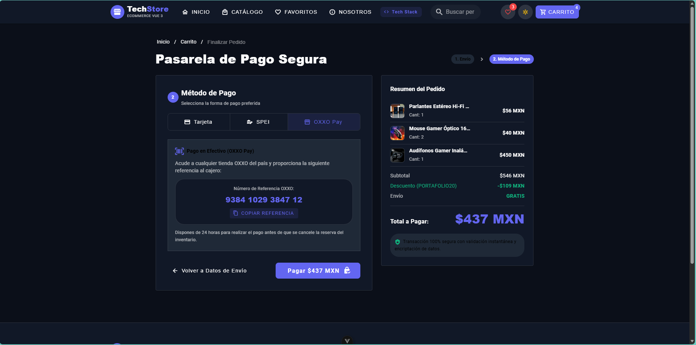
</p>

---

### 8. Comprobante Digital de Compra e Impresión
Comprobante oficial generado con folio único de pedido (`#TS-XXXXXX`), datos del cliente, método de pago aprobado, desglose de artículos y botón de impresión en formato de factura.

#### 8.1 Encabezado y Datos de la Orden Confirmada
Folio único registrado, fecha y hora localizada, estatus de pago aprobado y dirección de entrega.
<p align="center">
  
</p>

#### 8.2 Desglose de Artículos, Totales y Acciones
Tabla detallada con productos adquiridos, cantidades, precios unitarios, descuento aplicado y botones para imprimir el comprobante o volver a la tienda.
<p align="center">
  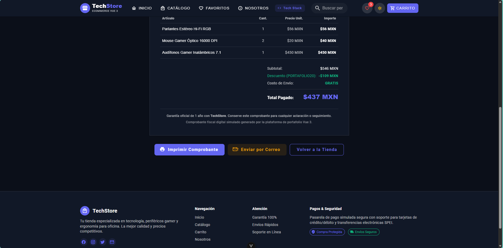
</p>

* **Aspectos técnicos**: Estilos de impresión `@media print` de alta fidelidad que eliminan los elementos web circundantes y generan una factura comercial limpia y nítida en papel o PDF.

---

## 🏗️ Arquitectura y Flujo de Datos

El proyecto implementa un flujo unidireccional de datos apoyado en Pinia y VueUse, garantizando sincronización en tiempo real sin mutaciones descontroladas de estado:

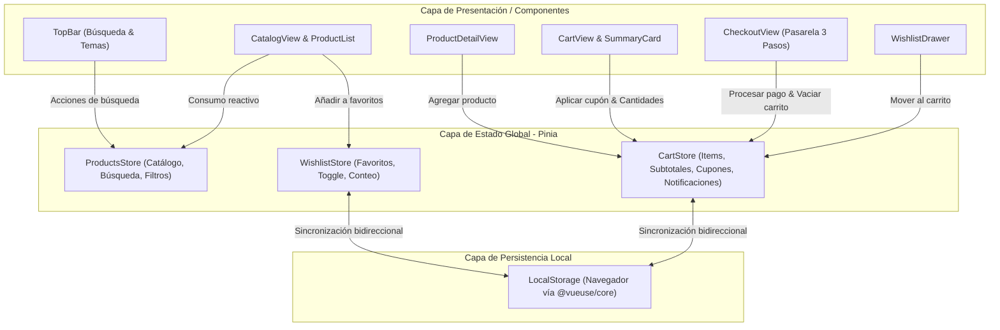

---

## 💡 Aspectos Técnicos Destacados

* **Composition API con `<script setup lang="ts">`**: Código limpio, modular y conciso aprovechando las últimas convenciones de Vue 3.5+.
* **Gestión Reactiva con Pinia**: Uso intensivo de *getters* reactivos para subtotales, impuestos, porcentaje de descuento y contadores en tiempo real.
* **Persistencia con VueUse**: Sincronización automática de `cartDetails`, `cartCouponCode` y `wishlistItems` con `localStorage` sin llamadas manuales a `setItem`.
* **Validación de Formularios en Dos Fases**: Formulario de envío y pasarela de pago con validadores personalizados (expresiones regulares para correo, máscara de tarjeta, fecha de expiración no vencida y algoritmo de control de longitud).
* **Tarjeta de Crédito Simulada**: Renderiza en tiempo real los dígitos, el titular y la vigencia con animación y detección visual de entidad bancaria.
* **Separación de Vistas y Ruteo Dinámico**: Separación completa entre vista de catálogo (`/products`), detalle de producto (`/products/:id`), carrito (`/cart`), pasarela de pago (`/checkout`) y sección corporativa (`/about`).
* **Optimización de Bundle**: Empaquetado ultrarrápido con Vite 7 y división de código por rutas (*lazy loading*).

---

## 📂 Estructura del Proyecto

```
vue-3-ecommerce/
├── assets/
│   └── readme-images/            # Capturas de pantalla organizadas para el README
├── public/
│   └── data/
│       └── products.json         # Mock data estructurado con specs y categorías
├── src/
│   ├── assets/                   # Estilos base, CSS variables y fuentes
│   ├── components/               # Componentes modulares y reutilizables
│   │   ├── cart/
│   │   │   ├── CheckoutModal.vue     # Modal alternativo de checkout rápido
│   │   │   ├── ShoppingCart.vue      # Listado de productos en carrito
│   │   │   ├── ShoppingCartItem.vue  # Renglón individual de producto en carrito
│   │   │   └── SummaryCard.vue       # Resumen de orden, cupones y checkout
│   │   ├── left/
│   │   │   ├── CategoryOptions.vue   # Selector de categorías con iconos
│   │   │   └── OrderOptions.vue      # Criterios de ordenamiento (precio, nombre)
│   │   ├── LeftMenu.vue              # Barra lateral de filtros y slider de precio
│   │   ├── NoEmailModal.vue          # Modal de privacidad y aviso de entorno demo
│   │   ├── PortfolioTechModal.vue    # Modal informativo con stack para reclutadores
│   │   ├── ProductCard.vue           # Tarjeta individual con badges y acciones
│   │   ├── ProductDetailModal.vue    # Modal de vista rápida y especificaciones
│   │   ├── ProductList.vue           # Grid responsivo con skeletons y empty state
│   │   ├── TopBar.vue                # Barra superior con búsqueda y cambio de tema
│   │   └── WishlistDrawer.vue        # Cajón lateral interactivo de favoritos
│   ├── model/
│   │   └── types.ts                  # Interfaces TypeScript (Product, Cart, Order, etc.)
│   ├── router/
│   │   └── index.ts                  # Rutas SPA con lazy loading y breadcrumbs
│   ├── stores/                       # Manejadores de estado global con Pinia
│   │   ├── cart.ts                   # Carrito, cupones, notificaciones globales
│   │   ├── products.ts               # Catálogo, filtrado reactivo y ordenamiento
│   │   └── wishlist.ts               # Favoritos con persistencia local
│   ├── views/                        # Páginas principales de la aplicación
│   │   ├── AboutView.vue             # Información corporativa y soporte
│   │   ├── CartView.vue              # Vista principal del carrito
│   │   ├── CatalogView.vue           # Catálogo extendido con panel de filtros
│   │   ├── CheckoutView.vue          # Pasarela de pago completa en 3 pasos
│   │   ├── HomeView.vue              # Landing page con hero banner y destacados
│   │   ├── ProductDetailView.vue     # Página dedicada de producto
│   │   └── WishlistView.vue          # Página dedicada de lista de deseos
│   ├── App.vue                       # Shell principal con snackbars y footer
│   └── main.ts                       # Punto de entrada, registro de plugins y temas
├── index.html                        # Plantilla HTML base
├── package.json                      # Metadatos, dependencias y scripts
├── tsconfig.json                     # Configuración de TypeScript
└── vite.config.ts                    # Configuración de Vite y plugins
```

---

## 🛠️ Stack Tecnológico

| Herramienta | Versión | Rol en el Proyecto |
| :--- | :---: | :--- |
| **Vue.js** | `v3.5+` | Framework base con Composition API y reactividad moderna |
| **TypeScript** | `v5.8+` | Tipado estático estricto en modelos, props y stores |
| **Pinia** | `v3.0+` | Gestión de estado global ligera y modular |
| **Vuetify** | `v3.13+` | Sistema de diseño UI basado en Material Design 3 con temas |
| **Vite** | `v7.3+` | Bundler y servidor de desarrollo con HMR instantáneo |
| **Vue Router** | `v4.6+` | Enrutamiento declarativo para Single Page Applications |
| **VueUse** | `v13.9+` | Colección de composables reactivos (`useLocalStorage`) |
| **Material Design Icons** | `v7.4+` | Iconografía vectorizada completa (`@mdi/font`) |

---

## 💻 Instalación y Puesta en Marcha

### Prerrequisitos
* **Node.js**: Versión 18.0.0 o superior
* **npm**: Versión 9.0.0 o superior

### Pasos de Instalación

1. **Clonar el repositorio:**
   ```bash
   git clone https://github.com/Nano-DevCode/vue-3-ecommerce.git
   cd vue-3-ecommerce
   ```

2. **Instalar dependencias:**
   ```bash
   npm install
   ```

3. **Ejecutar servidor de desarrollo local:**
   ```bash
   npm run dev
   ```
   Abre [http://localhost:5173](http://localhost:5173) en tu navegador para ver la plataforma en funcionamiento.

4. **Compilar y validar tipos para producción:**
   ```bash
   npm run build
   ```
   *Ejecuta `vue-tsc` (chequeo estricto de tipos de TypeScript) seguido del empaquetado optimizado en `dist/`.*

5. **Auditar código con el linter:**
   ```bash
   npm run lint
   ```

---

## 📄 Licencia & Créditos

Este proyecto está bajo la Licencia [MIT](LICENSE). Consulta el archivo [LICENSE](LICENSE) para más detalles. Siéntete libre de utilizarlo como inspiración o base para tus propios proyectos.

Copyright © 2026 **Nano-DevCode**.  
*¿Te gustó este proyecto? No dudes en darle una ⭐ en GitHub.*
